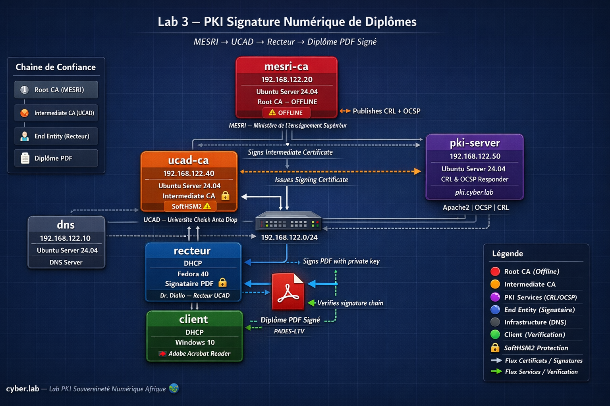

## Contexte & Objectifs

Dans le secteur universitaire et sur le marché de l'emploi en Afrique, l'on déplore une falsification massive des diplômes. Cela est dû à un manque d'infrastructure fiable pouvant servir à la vérification de la validité des diplômes délivrés par les Universités et Ecoles Africaines.

Avec la PKI, cette infrastructure de vérification est réalisable en utilisant la **signature numérique**. 
Comment la signature numérique peut-elle empêcher la falsification des diplômes ? Comment reconnaître la validité d'un diplôme signé numériquement ?

La falsification de diplôme survient lorsqu'un *diplômé* souhaite postuler à un emploi ou candidater à une formation. Dans ce scénarion nous avons 2 acteurs concerné : l'université qui a délivré le diplôme, le responsable de recrutement qui reçoit le diplôme. Comment ce dernier pourrait faire confiance au diplôme présenté par l'étudiant ? Comment peut-il en attesté la validité ?

Pour ce faire il faut qu'il ait une entité tierce reconnue comme autorité de confiance par le reponsable de recrutement. Cette entité (le MESRI pour Ministère de l'Enseignement Supérieur, de la Recherche et de l'Innovation au Sénégal)  ne signera pas les diplômes directement, son rôle sera de certifier l'identité de l'Université, ce qui garantit :
- que la signature posée sur le diplôme provient bien de l'Université en question et non à un tier malveillant
- l'intégrité du document car la signature se retrouverait invalide s'il y a modification
- La non-répudiation : l'université ne peut nier avoir signé/délivré le diplôme
Le recruteur n'aura pas à contacter l'Université pour vérfication, le certificat de l'université est embarqué dans le PDF, Adobe Acrobat l'extrayera et fera la vérification automatiquement puis remontera la chaîne de confiance jusqu'au MERSI

L'on sait que les certificats ont tous une date d'expiration, de ce fait, l'on ne saurait vérifier la validité d'un diplôme si le certificat du signataire expire, de même si sa clé privée utilisé pour signer le document se retrouve compromise. Comment préserver la validité d'un diplôme dans ces deux cas ? Quand est-ce que la signature doit être valide ?

La signature numérique ne doit pas être valide au moment de la vérification mais plutôt au moment de l'émission. Ce que résout le **PAdES-LTV** que nous détaillerons plutard.

Pour implémenter cettre infrastructure de confiance, nous adopterons la hiérarchie suivante :
- une Root CA qui est le MESRI
- une SubCA représentant l'Université (dans notre ca l'UCAD)
- la personne habiletée à signer les diplômes dans l'université, nous prendrons le Recteur

Dans le lab nous allons implémenter :
- une PKI avec **Step-CA** et **SoftHSM2**
- un **certificat de signature** pour le Recteur
- la Signature PDF avec PyHanko (PAdES)
- la vérification avec Adobe Acrobat Reader

**Objectifs d'apprentissage**
- Maîtriser Step-CA
- Comprendre PKCS#11 avec SoftHSM2
- Implémenter PAdES
- Cas d'usage concret - souveraineté numérique

____

## Topologie



___

## Configuration réseau

| Machine      | Rôle            | OS            | HSM      | IP             | FQDN              |
| ------------ | --------------- | ------------- | -------- | -------------- | ----------------- |
| `mesri-ca`   | Root CA         | Ubuntu Server | SoftHSM2 | 192.168.122.20 | rootca1.cyber.lab |
| `ucad-ca`    | Intermediate CA | Ubuntu Server | SoftHSM2 | 192.168.122.40 | subca1.cyber.lab  |
| `recteur`    | Signataire PDF  | Fedora        | SoftHSM2 | DHCP           | —                 |
| `dns`        | DNS             | Ubuntu Server | —        | 192.168.122.10 | dns.cyber.lab     |
| `client`     | Adobe Reader    | Windows 10    | —        | DHCP           | —                 |

___

## PHASE 1 : Installation des outils

Dans ce lab nous avons besoins de :
- **Step-CA** : C'est une serveur CA exposant une API REST permettant l'automatisation de l'émission, le renouvellement et la révocation des certificats. Pour la Root CA qui doit être offline et isolé du réseau, nous allons utiliser **OpenSSL CA**. **Step-CA** est fait pour des CAs opérationnellement, cas typique pour notre SubCA, pas pour des Root CAs devant restées offline.
- **OpenSSL CA** pour la RootCA devant restée offline
- **SoftHSM2** : il simule un module matériel sécurisé en stockant des clés privées dans une base de données chiffrées sur le Disque. Il va stocker les clés privées hors du filesystem classique.
- **GnuTLS** : une suite d'outils cryptographique notament `p11tool` pour intéragir avec les tokens PKCS#11. Il est utilisé pour lister, inspecter et vérifier des clés privées stockées dans le SoftHSM2
- **libengine-pkcs11-openssl** : Plugin PKCS#11 pour OpenSSL, il permet à OpenSSL de déléguer les opérations cryptographiques à un token PKCS#11 comme SoftHSM2. 
- **PyHanko** : Bibliothèque Python spécialisée dans la signature PDF, elle supporte PAdES, LTV, timestamps
- **Opensc** : Suite d'outils pour smartcards et tokens PKCS#11, fournit `pkcs11-tool` pour interagir avec SoftHSM2.Il sera utilisé pour générer les paires de clés dans le SoftHSM.
- **python-pkcs11**: Librairie python permettant d'utiliser PKCS#11

Pour les intaller nous allons taper ces commandes :

Sur le RootCA :
```sh
apt update & apt install -y openssl softhsm2 gnutls-bin libengine-pkcs11-openssl opensc
```

Sur le SubCA (Step-CA sera installé séparément):
```sh
apt update && apt install -y softhsm2 gnutls-bin
```

Sur Fedora :
```sh
sudo dnf update -y
sudo dnf install -y softhsm opensc gnutls-utils python3-pip libengine-pkcs11-openssl
pip install 'pyHanko[pkcs11,image-support,opentype,qr]'
pip install pyhanko-cli python-pkcs11

```

___
## PHASE 2 : PKI MESRI (Root CA)
### Phase 2.1 - Initialiser SoftHSM2 sur le Root CA
Nous allons initialiser un **token** dans le SoftHSM2 du RootCA. Un token est une instance logique du HSM qui peut contenir des objects cryptographiques (clés privées, clés publiques, certificats, données secrètes) dans notre cas ici la clé privée du Root CA. 
Il dispose :
- Un Label / nom
- Un PIN utilisateur : utilisé pour manipuler les objets qui y sont stockées
- Un SO PIN pour l'administrateur
Initialisons notre token avec :

```sh
softhsm2-util --init-token --slot 0 --label "mesri-root" --pin 1234 \ --so-pin 2468
```


Le slot (emplacement physique ou logique où un token est inséré) a été réinitialisé à `1893920401`

___
### PHASE 2.2 : Générer la clé privée du Root CA dans SoftHSM2

Nous allons utiliser l'outil `pkcs11-tool` en spécifiant le la bibliothèque **PKCS#11** du SoftHSM `/usr/lib/softhsm/libsofthsm2.so`. C'est un outil générique, et ne sait pas quel HSM l'on utilise c'est pourquoi il faut la spécifier.

```sh
pkcs11-tool --module /usr/lib/softhsm/libsofthsm2.so \
  --login --pin 1234 \
  --keypairgen \
  --key-type rsa:4096 \
  --label "mesri-root-key" \
  --token-label "mesri-root"
```


Vérifions le contenu du token pour voir si la paire de clés y est avec :

```sh
pkcs11-tool --module /usr/lib/softhsm/libsofthsm2.so \
  --login --pin 1234 \
  --list-objects \
  --token-label "mesri-root"
```


___
### PHASE 2.3 - Création du certificat Root CA
Tout d'abord nous allons créer la structure du dossier du Root CA :
```sh
mkdir -p /root/pki/root/{private,certs,crl,csr,newcerts}
chmod 700 /root/pki/root/private
touch /root/pki/root/index.txt
echo 01 > /root/pki/root/serial
echo 01 > /root/pki/root/crlnumber
```

Puis le fichier de configuration `/root/pki/root/root.cnf` :

```ini
[ ca ]
default_ca = CA_default
# Point d'entrée principal — dit à OpenSSL quelle section
# utilise comme configuration par défaut

[ CA_default ]
# Répertoires de travail
dir               = /root/pki/root
# Répertoire racine de la PKI Root CA

certs             = $dir/certs
# Stocke les certificats émis

crl_dir           = $dir/crl
# Stocke les CRLs générées

new_certs_dir     = $dir/newcerts
# Archive une copie de chaque certificat signé
# nommée par son numéro de série

database          = $dir/index.txt
# Registre de tous les certificats émis
# Format : Status | Expiry | Serial | DN

serial            = $dir/serial
# Fichier contenant le prochain numéro de série
# Incrémenté automatiquement à chaque signature

crlnumber         = $dir/crlnumber
# Numéro de la prochaine CRL générée

private_key       = $dir/private/root.key
# On ne mettra rien ici — la clé est dans SoftHSM2
# On utilisera une URI PKCS#11 à la place

certificate       = $dir/certs/root.crt
# Certificat auto-signé du Root CA

crl               = $dir/crl/root.crl
# CRL courante du Root CA

default_md        = sha256
# Algorithme de hachage — SHA256 est le standard actuel

default_days      = 3650
# Durée de validité des certificats émis — 10 ans

default_crl_days  = 30
# Durée de validité d'une CRL — 30 jours

policy            = policy_strict
# Politique de validation des CSR

[ policy_strict ]
# Champs obligatoires et leurs contraintes
# match   = doit correspondre exactement au Root CA
# supplied = doit être fourni dans le CSR
# optional = peut être absent
countryName             = supplied
stateOrProvinceName     = supplied
organizationName        = supplied
commonName              = supplied

[ req ]
default_bits        = 4096
# Taille de clé par défaut — 4096 bits pour Root CA

prompt              = no
# Ne pas demander interactivement les champs DN

default_md          = sha256
distinguished_name  = dn

[ dn ]
# Distinguished Name du Root CA
C  = SN
# Sénégal

ST = Senegal
O  = MESRI
# Ministère de l'Enseignement Supérieur

CN = MESRI Root CA
# Nom qui apparaîtra dans les certificats

[ v3_ca ]
# Extensions appliquées au certificat Root CA
basicConstraints = critical, CA:true
# Cette entité EST une CA
# critical = le client doit comprendre cette extension

keyUsage = critical, keyCertSign, cRLSign
# keyCertSign = peut signer des certificats
# cRLSign     = peut signer des CRLs

subjectKeyIdentifier = hash
# Empreinte de la clé publique
# Permet d'identifier la clé dans la chaîne

authorityKeyIdentifier = keyid:always, issuer
# Référence à la clé qui a signé ce certificat
# Pour Root CA = se référence lui-même

[ v3_intermediate_ca ]
# Extensions appliquées au certificat Intermediate CA
basicConstraints = critical, CA:true, pathlen:0
# CA:true   = c'est une CA
# pathlen:0 = ne peut pas créer de Sub-CA en dessous

keyUsage = critical, keyCertSign, cRLSign
subjectKeyIdentifier = hash
authorityKeyIdentifier = keyid:always, issuer

crlDistributionPoints = URI:http://rootca1.cyber.lab/root.crl
# Le client cherche la CRL du Root CA ici

[ ocsp ]
# Extensions pour le certificat OCSP Responder du Root CA
basicConstraints = CA:FALSE
keyUsage = critical, digitalSignature
extendedKeyUsage = OCSPSigning
# Autorise explicitement ce certificat à signer
# des réponses OCSP

subjectKeyIdentifier = hash
noCheck = ignored
# RFC 6960 — dit au client de ne pas vérifier
# la révocation de CE certificat OCSP
# évite la boucle infinie de vérification
```

Pour pouvoir générer le certificat du Root CA, nous devons tout d'abord récupérer l'URI PKCS#11 de la clé en listant les objets du token `mesri-root` avec `p11tool` de GnuTLS :

```sh
p11tool --list-all --login "pkcs11:token=mesri-root" --provider /usr/lib/softhsm/libsofthsm2.so
```
 
```text
pkcs11:model=SoftHSM%20v2;manufacturer=SoftHSM%20project;serial=cdb4e58ef0e2ee91;token=mesri-root;object=mesri-root-key;type=private
```

Puis l'utiliser pour créer le certificat :

```sh
openssl req -new -x509 \
  -engine pkcs11 \
  -keyform engine \
  -key "pkcs11:model=SoftHSM%20v2;manufacturer=SoftHSM%20project;serial=cdb4e58ef0e2ee91;token=mesri-root;object=mesri-root-key;type=private;pin-value=1234"\
  -config /root/pki/root/root.cnf \
  -extensions v3_ca \
  -days 7300 \
  -sha256 \
  -out /root/pki/root/certs/root.crt
```

___
### PHASE 2.4 — Générer la CRL initiale du Root CA

```sh
openssl ca -config /root/pki/root/root.cnf \
  -gencrl \
  -keyfile "pkcs11:model=SoftHSM%20v2;manufacturer=SoftHSM%20project;serial=cdb4e58ef0e2ee91;token=mesri-root;object=mesri-root-key;type=private;pin-value=1234" \
  -keyform engine \
  -engine pkcs11 \
  -out /root/pki/root/crl/root.crl
```

Nous avons fini avec la création du Root CA, passons maintenant à celle du SubCA (l'Université nous prendrons UCAD).

### PHASE 2.5 : Démarrage du serveur CRL

Nous allons démarrer un serveur avec le module `http.server` de Python dans le dossier `pki/root/crl` pour rendre la CRL accessible sur le port 80

> En production le Root CA est gardé Offline et le CRL est hébèregé sur un serveur dédié. Dans le cadre de ce lab nous allons l'héberger sur le Root CA

```sh
python3 -m http.server -d pki/root/crl 80
```

___

## PHASE 3 - PKI Université avec Step-CA

Différentes méthodes pourraient nous permettre d'installer `step-ca`, nous allons utiliser la [](https://github.com/smallstep/certificates/blob/master/CONTRIBUTING.md#11**](https://github.com/smallstep/certificates/blob/master/CONTRIBUTING.md#11**](https://github.com/smallstep/certificates/blob/master/CONTRIBUTING.md#11**](https://github.com/smallstep/certificates/blob/master/CONTRIBUTING.md#11**](https://github.com/smallstep/certificates/blob/master/CONTRIBUTING.md#11**](https://github.com/smallstep/certificates/blob/master/CONTRIBUTING.md#11**](https://github.com/smallstep/certificates/blob/master/CONTRIBUTING.md#11**](https://github.com/smallstep/certificates/blob/master/CONTRIBUTING.md#11**](https://github.com/smallstep/certificates/blob/master/CONTRIBUTING.md#11**](https://github.com/smallstep/certificates/blob/master/CONTRIBUTING.md#11**](https://github.com/smallstep/certificates/blob/master/CONTRIBUTING.md#11**](https://github.com/smallstep/certificates/blob/master/CONTRIBUTING.md#11**](https://github.com/smallstep/certificates/blob/master/CONTRIBUTING.md#11**](https://github.com/smallstep/certificates/blob/master/CONTRIBUTING.md#11**](https://github.com/smallstep/certificates/blob/master/CONTRIBUTING.md#11**](https://github.com/smallstep/certificates/blob/master/CONTRIBUTING.md#11**](https://github.com/smallstep/certificates/blob/master/CONTRIBUTING.md#11**](https://github.com/smallstep/certificates/blob/master/CONTRIBUTING.md#11**](https://github.com/smallstep/certificates/blob/master/CONTRIBUTING.md#11**](https://github.com/smallstep/certificates/blob/master/CONTRIBUTING.md#11**](https://github.com/smallstep/certificates/blob/master/CONTRIBUTING.md#11**](https://github.com/smallstep/certificates/blob/master/CONTRIBUTING.md#11**](https://github.com/smallstep/certificates/blob/master/CONTRIBUTING.md#11**](https://github.com/smallstep/certificates/blob/master/CONTRIBUTING.md#11**](https://github.com/smallstep/certificates/blob/master/CONTRIBUTING.md#11**](https://github.com/smallstep/certificates/blob/master/CONTRIBUTING.md#11**](https://github.com/smallstep/certificates/blob/master/CONTRIBUTING.md#11**](https://github.com/smallstep/certificates/blob/master/CONTRIBUTING.md#11**](https://github.com/smallstep/certificates/blob/master/CONTRIBUTING.md#11**](https://github.com/smallstep/certificates/blob/master/CONTRIBUTING.md#11**](https://github.com/smallstep/certificates/blob/master/CONTRIBUTING.md#11**](https://github.com/smallstep/certificates/blob/master/CONTRIBUTING.md#11**](https://github.com/smallstep/certificates/blob/master/CONTRIBUTING.md#build-step-ca-using-cgo). 

Installons d'abord les prérequis :
```sh
sudo apt-get install libpcsclite-dev golang make gcc
```

Clonons le dépôt de smallstep :
```sh
git clone https://github.com/smallstep/certificates
```

Compilons step-ca :
```sh
make bootstrap && make build GO_ENVS="CGO_ENABLED=1"
```
Installons maintenant step-cli :
```sh
# Téléchargement du package
wget https://dl.smallstep.com/gh-release/cli/gh-release-header/v0.30.1/step-cli_0.30.1-1_amd64.deb

# Installation du package
dpkg -i step-cli_0.30.1-1_amd64.deb
```

Nous avons aussi besoin du plugin `step kms` :
```sh
go install github.com/smallstep/step-kms-plugin@latest

# Copions-le dans le dossier des plugins
mkdir -p ~/.step/plugins/
cp ~/go/bin/step-kms-plugin ~/.step/plugins/
```

> Pour plus de détail concernant l'utilisation de step-ca avec les modules HSM veuillez-vous referez à la [](https://smallstep.com/docs/step-ca/cryptographic-protection/#pkcs-11).

___

### PHASE 3.1 — Initialiser SoftHSM2 sur le SubCA

Nous allons créer un token avec le nom `ucad-intermediate` :

```sh
softhsm2-util --init-token --slot 0 --label "ucad-subca" --pin 1234 --so-pin 5678
```

### PHASE 3.2 - Initialiser Step-CA avec SoftHSM2

Puisque notre RootCA est séparé du SubCA, ce que nous allons faire ici est de : 
- générer la clé privée du SubCA dans le SoftHSM
- générer un CSR signé par cette clé
- copier le CSR sur le Root CA
- émettre le certificat du SubCA depuis le RootCA et le copier sur le SubCA
- copier le certificat du RootCA sur le SubCA
- configurer `step-ca` pour qu'il utilise les certificats du Root CA et du SubCA, et la clé privée du SubCA dans le SoftHSM2

#### **Génération de la clé privée du SubCA**

```sh
step kms create --json --kms "pkcs11:module-path=/usr/lib/softhsm/libsofthsm2.so;token=ucad-subca?pin-value=1234" "pkcs11:id=01;object=ucad-subca-key" --kty RSA --size 4096 
```

La clé publique en sortie :
```json
{
  "name": "pkcs11:id=01;object=ucad-subca-key",
  "publicKey": "-----BEGIN PUBLIC KEY-----\nMIICIjANBgkqhkiG9w0BAQEFAAOCAg8AMIICCgKCAgEAyvSijDI658wAwlDcQzyZ\nP7Cx8xakNvuEwuwUWzBapfJOhDZLNEeB03BqffbokO9Q+kIzs94SkfBKHwnC2ha+\nq/6Pqi0Z3cRKH7vvR11gS67CNY3Cb6qnBmY1tiUANNmA5Yz+hr3BK3WGVSoO9i4x\n37QpRn0AzvwhQS4OS5+xwDfATF1miPtvPDxKEi/VXvLckJ6Nj3jDLiTSSJYtejRc\n0HHolf/n7cYG5HeSGA1AIXWorEicVPMtclFL9nyz+kVSd+sntDNNB0FaFpVy+JRS\nnD7qUOesgCX8p2yNc1YZe8uF4bR+d9gMvKfPUO7eQlVmQsXTSrOKfW06/pY0oHg+\nTBJHGVoU404lQUAm+IovJmo3f57G1S52ujtYsa2LuKlone+l6TyVf5EUJDyJvU1g\ncCV7lmF6Gy1kBooyghRgLVLg8wfqVEg2Gl1pjALe1K+yMW43CInMODqVwNbZlXxA\nsyAtAK5HWZSRPdds/vpADw7EFIeokc9AIQQU3gU5qB6KXc3Yf9s1d08Hq25R9ipP\nU14jnbxI/n10+PEPG/L6vH0vQkTUhOLC5demdKS+PZ+04DPebjPFwGBNfVrk4i/w\n4q3asYB6EiidV5prxA2zHXO1I0RJ/xU/h2KlSZJUUck1K1BrhB6yT5pPPegDF+FP\nrqR3jrBzPzwLY6stWfAgBnkCAwEAAQ==\n-----END PUBLIC KEY-----\n"
}
```

**Explication des paramètres :**
- `--kty` : type de la clé
- `--size` : taille de la clé
- `--kms` : URI du token SoftHSM2

#### Génération du CSR du SubCA

```sh
# Creation du template
nano subca-csr.tpl
```

Le contenu du template
```json
{
    "subject": {
        "country": "SN",
        "province": "Senegal",
        "locality": "Dakar",
        "organization": "UCAD",
        "commonName": "UCAD Intermediate CA"
    },
    "keyUsage": ["certSign", "crlSign"],
    "basicConstraints": {
        "isCA": true,
        "maxPathLen": 0
    }
}
```

Générons le CSR
```sh
step certificate create --csr --kms "pkcs11:module-path=/usr/lib/softhsm/libsofthsm2.so;token=ucad-subca?pin-value=1234" -key "pkcs11:model=SoftHSM%20v2;manufacturer=SoftHSM%20project;serial=011fc105a6bd2308;token=ucad-subca;id=%01;object=ucad-subca-key;type=public" "UCAD Intermediate CA" ucad-subca.csr --template subca-csr.tpl 
```

Copions le CSR sur le RootCA :
```sh
scp ucad-subca.csr root@rootca1.cyber.lab:~/
```
- `--key` est l'URL de la clé publique obtenu avec l'outil `p11tool`, n'utiliser que l'Object Identifier va générer une erreur disant que la clé publique est introuvable
- `ksm` est l'URI du token 

#### Emission du certificat du SubCA
Après avoir copié le CSR sur le Root CA, nous allons utiliser `openssl ca` pour émettre le certificat du SubCA :

```sh
openssl ca -config /root/pki/root/root.cnf \
  -extensions v3_intermediate_ca \
  -days 3650 -notext -md sha256 \
  -engine pkcs11 \
  -keyform engine \
  -keyfile "pkcs11:token=mesri-root;object=mesri-root-key;type=private;pin-value=1234" \
  -in ~/ucad-subca.csr \
  -out ~/ucad-subca.crt

# Copie des certificats de MESRI et de UCAD sur le SubCA
scp ucad-subca.crt  root@subca1.cyber.lab:~/
```

#### Configurer `step-ca` pour qu'il utilise notre PKI

Tout d'abord nous allons initialiser le CA sur le SubCA:
```sh
step ca init
# le mot de passe du provisionner est : admin
```


Le provisionner est une méthode d'authentification qui autorise une entité à demander un certificat et par défaut est une authentification avec identifiant et mot de passe.Quand on veut émettre un certificat avec le SubCA, step-ca nous demandera le provisionner à utiliser (`admin@ucad.sn`) plus son mot de passe. Sans provisioner, l'on ne peut demander un certificat.

> Il faut noter que `admin@ucad.sn` n'est que identifiant pour le provisioner, l'on peut mettre n'importe quel autre identifiant

Après l'initialisation de la CA, nous allons remplacer les certificats du Root et de l'Intermediate par ceux de notre PKI :

```sh
cp root.crt /root/.step/certs/root_ca.crt
cp ucad-subca.crt /root/.step/certs/intermediate_ca.crt
```

Ensuite supprimer les clés privées :
```sh
shred -u $(step path)/secrets/root_ca_key
rm /root/.step/secrets/intermediate_ca_key
```

Puis éditer la configuration du CA `/root/.step/config/ca.json`  en remplaçant le chemin vers la clé privée du SubCA par l'URL de la clé privée dans le SoftHSM et ajouté l'objet `kms`:
```json
{
    "root": "/etc/step-ca/certs/root_ca.crt",
    "crt": "/etc/step-ca/certs/intermediate_ca.crt",
    "key": "pkcs11:model=SoftHSM%20v2;manufacturer=SoftHSM%20project;serial=011fc105a6bd2308;token=ucad-subca;id=%01;object=ucad-subca-key;type=private",
    "kms": {
        "type": "pkcs11",
        "uri": "pkcs11:module-path=/usr/lib/softhsm/libsofthsm2.so;token=ucad-subca?pin-value=1234"
    }
}
```

Enfin démarrons `step-ca` avec la configuration :

```sh
step-ca .step/config/ca.json
```


### PHASE 3.3 : Le CRL Server

La révocation est un concept essentiel pour une PKI, elle permet d'invalider un certificat même si la période d'expiration n'a pas été atteint si sa clé se retrouve compromise.

Dans le lab, nous allons l'implémenter sur le SubCA en démarrons le serveur CRL intégré de `step-ca`.
Pour ce faire, ajoutant ceci à la config du CA :

```json
"insecureAddress": ":9001",
"crl": {
  "enabled": true,
  "idpURL": "http://subca1.cyber.lab/1.0/crl"
},
```

La CRL du SubCA sera accessible à l'endpoint : `http://subca1.cyber.lab:9001/1.0/crl`
 
___
## PHASE 4 - Certificat du Recteur

Le Recteur a besoin d'une identité numérique pour pouvoir signer les diplômes. Elle est composée de deux éléments indispensables :
- La clé privée : stockée dans le SoftHSM et ne sort jamais
- Le certificat du recteur émis par UCAD SubCA avec l'extension requise pour la signature 

Pour créer cette identité numérique, nous allons :
- Générer la clé privée du recteur dans le SoftHSM et du CSR
- Créer un template pour le certificat sur le SubCA et émettre le certificat du recteur
- Configurer pyHanko pour qu'il utilise la clé privée et le certificat pour signer les PDF

### PHASE 4.1 : Génération de la clé privée dans le SoftHSM du recteur

SoftHSM par défaut ne peut être utilisé qu'en mode root, nous allons créer une config utilisateur pour permettre au Recteur d'utiliser sa clé privée.

```sh

mkdir -p ~/.config/softhsm2
mkdir -p ~/.softhsm2/tokens

cat > ~/.config/softhsm2/softhsm2.conf << EOF
directories.tokendir = $HOME/.softhsm2/tokens/
objectstore.backend = file
EOF

export SOFTHSM2_CONF=~/.config/softhsm2/softhsm2.conf
```
Les tokens de l'utilisateur seront stockés dans `~/.softhsm2/tokens`
Initialisation du token 
```sh
softhsm2-util --init-token --slot 0 --label "recteur" --pin 1234 --so-pin 5678
```

Génération des clés
```sh
pkcs11-tool --module /usr/lib64/softhsm/libsofthsm.so --login --token-label "recteur" --pin 1234 --keypairgen --key-type rsa:2048 --label "recteur-key"
```

Génération du CSR
```sh
openssl req -new \
  -engine pkcs11 \
  -keyform engine \
  -key "pkcs11:model=SoftHSM%20v2;manufacturer=SoftHSM%20project;serial=247e8903bf1b2f9e;token=recteur;object=recteur-key;type=public?pin-value=1234" \
  -out ~/recteur-diallo.csr \
  -subj "/C=SN/ST=Senegal/O=UCAD/CN=Recteur UCAD"
  
# Copie sur le subca
scp recteur.csr root@192.168.122.40:~/
```

### PHASE 4.2 - Créer un template pour le certificat du recteur

Création du template
```sh
nano recteur.json
```

Contenu du template

```json
{
    "subject": {
        "country": "SN",
        "province": "Senegal",
        "locality": "Dakar",
        "organization": "UCAD",
        "commonName": "Recteur UCAD"
    },
    "keyUsage": ["digitalSignature", "nonRepudiation"],
    "extKeyUsage": ["emailProtection"],
    "basicConstraints": {
        "isCA": false
    },
    "crlDistributionPoints": ["http://subca1.cyber.lab:9001/1.0/crl"]
}
```

- `digitalSignature`  →  peut signer 
- `nonRepudiation`    →  ne peut pas nier avoir signé
- `emailProtection`   →  usage document/signature
- `isCA: false`       →  c'est un end-entity

Avant d'émettre le certificat, nous devons d'abord configurer le provisionner pour qu'il utilise le template `recteur.json` pour émettre des certificats :

```sh
step ca provisioner update admin@ucad.sn --x509-template recteur.json
```

Le certificat du recteur aura une durée d'1 an, la durée maximale de certificat pouvant être emis étant de 24h, nous allons l'augementer en ajoutant la section `claims` dans la config du CA :
```json
"claims": { 
		"minTLSCertDuration": "5m",
		"maxTLSCertDuration": "87600h",
		"defaultTLSCertDuration": "24h"
}
```

Ensuite émettons le certificat du recteur pour 1 an:
```sh
step ca sign recteur.csr recteur.crt  --not-after=8760h
scp recteur.crt mrrobot@192.168.122.24:~/certificate
```

___

## PHASE 5 : Signature PDF

Dans cette phase nous allons signé un document PDF Fictif. Après une lecture approfondie de la documentation du `pyhanko`, j'ai pu développé ce bout de code :

```python
from pyhanko.sign import pkcs11, signers, timestamps, fields
from pyhanko.pdf_utils.incremental_writer import IncrementalPdfFileWriter
from asn1crypto import x509, pem
import asyncio
from pyhanko import stamp
from pyhanko.pdf_utils import text, images
from pyhanko.pdf_utils.font import opentype
from pyhanko.sign.fields import SigSeedSubFilter
from pyhanko_certvalidator import ValidationContext

# Fonction pour decoder le PEM
def pemDecode(cert_path):
    with open(cert_path, "rb") as f:
        pem_byte = f.read()
        _,_, certdata = pem.unarmor(pem_byte)
        cert = x509.Certificate.load(certdata)
    return cert

# Paramètre
DOCUMENT_PATH = "/home/mrrobot/certificate/document.pdf"
RCTR_CERT = "/home/mrrobot/certificate/recteur.crt"
INTRMDT_CERT = "/home/mrrobot/certificate/intermediate_ca.crt"
MODULE_PATH = "/usr/lib64/softhsm/libsofthsm.so"
SLOT_NO = 0
TOKEN_LABEL = "recteur"
KEY_LABEL = "recteur-key"
PNG_STAMP_PATH = "/home/mrrobot/certificate/ucad.jpg"

async def sign():
    # Initialisation de la session
    session = pkcs11.open_pkcs11_session(MODULE_PATH, slot_no=SLOT_NO, token_label=TOKEN_LABEL, user_pin="1234")

    # Créations du CMS
    signer = pkcs11.PKCS11Signer(pkcs11_session=session, signing_cert=pemDecode(cert_path=RCTR_CERT), ca_chain=[pemDecode(INTRMDT_CERT)])

    # Le timestamp
    timestmp = timestamps.HTTPTimeStamper("https://freetsa.org/tsr")

    # Metadata avec les réponses CRLs
    signature_meta = signers.PdfSignatureMetadata(
        field_name='Signature', md_algorithm='sha256',
        # Mark the signature as a PAdES signature
        subfilter=SigSeedSubFilter.PADES,
        # We'll also need a validation context
        # to fetch & embed revocation info.
        validation_context=ValidationContext(allow_fetching=True),
        # Embed relevant OCSP responses / CRLs (PAdES-LT)
        embed_validation_info=True,
        # Tell pyHanko to put in an extra DocumentTimeStamp
        # to kick off the PAdES-LTA timestamp chain.
        use_pades_lta=True
    )

    # La signature 
    with open(DOCUMENT_PATH, 'rb') as doc:
        w = IncrementalPdfFileWriter(doc)
        fields.append_signature_field(
    w, sig_field_spec=fields.SigFieldSpec(
        'Signature', 
        # (x_bas_gauche, y_bas_gauche, x_haut_droit, y_haut_droit)
        box=(400, 50, 550, 110) 
    )
)
        out = signers.PdfSigner(
            signature_meta=signature_meta,
            signer=signer, timestamper=timestmp, 
            stamp_style=stamp.TextStampStyle(
                stamp_text="Signé par : %(signer)s\nTime: %(ts)s",
                text_box_style=text.TextBoxStyle(
                font=opentype.GlyphAccumulatorFactory('/home/mrrobot/certificate/AdwaitaSans-Regular.ttf')
                ),
                background=images.PdfImage(PNG_STAMP_PATH)
            )
        )
        with open("signed.pdf", "wb") as out_file:
            await out.async_sign_pdf(w, output=out_file)
        

asyncio.run(sign())
```

> Les reférences seront mises à la fin du document

